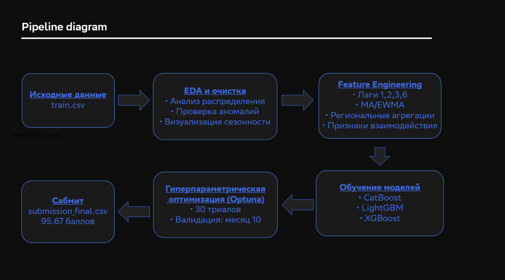
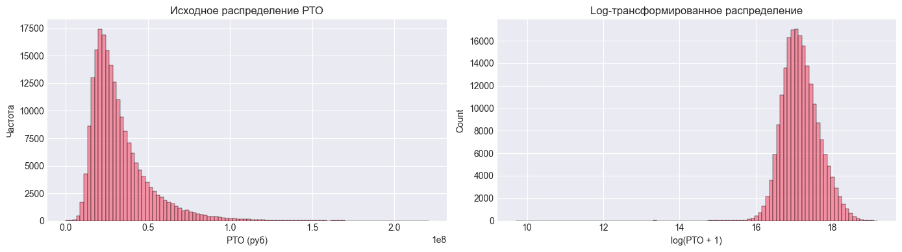
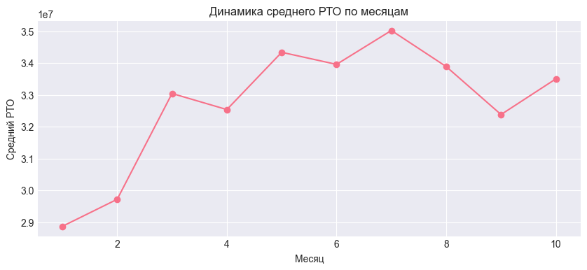

# Прогнозирование розничного товарооборота (РТО) магазинов «Пятёрочка». Соревнование по машинному обучению от программы КНАД ФКН НИУ ВШЭ и X5 Tech

## О хакатоне

- **Название:** Градиент роста - Соревнование по машинному обучению
- **Организатор:** НИУ ВШЭ и X5 Tech
- **Трек:** Студенческий
- **Диплом участника:** [`Диплом`](reports/diploma.jpg)
- **Результат:** **95.67 баллов** (1-е место — 96.54, 76 место из 300)

## Описание задачи

Ежедневно миллионы клиентов посещают магазины сети «Пятёрочка». Чтобы в торговых точках всегда было достаточно товара, а скоропортящиеся продукты были свежими, требуется качественно прогнозировать спрос.


**Цель проекта** — построить модель машинного обучения для прогнозирования розничного товарооборота (РТО) магазина на следующий месяц (ноябрь).

**Задачи:**
- Провести первичный исследовательский анализ данных
- Создать признаки (лаги, скользящие средние, региональные агрегации)
- Обучить и сравнить модели CatBoost, LightGBM, XGBoost
- Выполнить гиперпараметрическую оптимизацию (Optuna)
- Собрать взвешенный ансамбль для финального прогноза

**Метрика качества:** MAPE (Mean Absolute Percentage Error).  
Баллы = 100 − min(MAPE, 100)


**Бейзлайн организатора:** 54.34 балла

## Результат

**95.67 баллов** (100 — идеальный прогноз)

| Этап | Баллы | Ключевое изменение |
|------|-------|---------------------|
| Базовый CatBoost | 91.14 | Лаги + скользящие средние |
| + региональные признаки | 95.34 | shops_in_region, region_avg_rto_3 |
| + EWMA | 95.44 | Экспоненциальные скользящие средние |
| + признаки взаимодействия | 95.55 | traffic_per_capita, rto_per_cash |
| + Optuna | 95.55 | Гиперпараметрическая оптимизация |
| + ансамбль (3 модели) | **95.67** | CatBoost + LightGBM + XGBoost |

*Скриншоты посылок в папке [`reports/`](reports/)*

## Схема пайплайна



## Шаги решения

### Этап 1. EDA и Baseline




- Анализ распределения РТО → выявлена скошенность → применена log-трансформация
- Анализ сезонности → добавлены признаки месяца и циклические признаки (sin/cos)
- Проверка аномалий (скачки >200%, выбросы) — оставлены (доля <0.5%)
- Бейзлайн: прогноз = РТО прошлого месяца (MAPE ~6.37%)

### 2. Feature Engineering

- Лаги (1,2,3,6) и разностные признаки
- Скользящие средние (MA3, MA6) и EWMA (3,6)
- Региональные агрегации: количество магазинов в регионе, среднее РТО по региону, отношение к среднему
- Признаки взаимодействия: traffic_per_capita, rto_per_cash, population_density

### Этап 3. Обучение моделей 
- CatBoost, LightGBM, XGBoost с оптимизацией гиперпараметров (Optuna, 30 триалов)
- Сравнение одиночных моделей и ансамблей
- Выбор взвешенного ансамбля как финального решения

**Оптимизация гиперпараметров:** Optuna (30 триалов) на отложенной валидации (месяц 10)

### Ансамблирование

Взвешенное усреднение трёх моделей с весами, оптимизированными на валидации:

| Модель | Вес | MAPE (val) |
|--------|-----|-------------|
| CatBoost | 0.709 | 1.01% |
| LightGBM | 0.229 | 1.53% |
| XGBoost | 0.062 | 2.03% |

**Валидационный MAPE ансамбля:** 0.92%

**Результат на публичном LB:** 95.67 баллов


## Структура репозитория


```
hse_ml_champ_rto_prediction/
│
├── data/
│   ├── train.csv                # исходные данные (не публикуются)
│   └── processed/               # обработанные данные (pkl)
│
├── notebooks/
│   ├── production/              # основные ноутбуки
│   │   ├── 01_EDA_and_Baseline.ipynb
│   │   ├── 02_Feature_Engineering.ipynb
│   │   └── 03_Model_Training_and_Submission.ipynb
│   │
│   └── exploration/             # эксперименты с Optuna
│       ├── 04_Optuna_XGBoost.ipynb
│       ├── 05_Optuna_CatBoost.ipynb
│       └── 06_Optuna_LightGBM.ipynb
│
├── reports/                     # визуализации
│   ├── diploma.jpg
│   ├── pipeline_diagram.png
│   ├── submissions_history.jpg
│   ├── submissions_final.jpg
│   ├── eda_rto_distribution.png
│   └── eda_seasonality.png
│
├── submissions/                 # финальный сабмит
│   └── submission_final.csv
│
├── .gitignore
├── README.md
└── requirements.txt
```

## Запуск проекта

### 1. Установить Python

Требуется Python 3.10 или выше.

### 2. Клонировать репозиторий

```bash
git clone https://github.com/anastaness/hse_ml_champ_rto_prediction.git
cd hse_ml_champ_rto_prediction
```

### 3. Создать виртуальное окружение

```bash
python -m venv .venv
.venv\Scripts\activate      # Windows
source .venv/bin/activate   # Linux/macOS
```

### 4. Установить зависимости

```bash
pip install -r requirements.txt
```

### 5. Подготовить данные

Файл `train.csv`  с исходными данными предоставлен организаторами хакатона и не включен в репозиторий по условиям использования. Перед запуском необходимо вручную поместить файл в `data/train.csv`.

### 6. Запустить ноутбуки

```bash
jupyter notebook
```

Порядок выполнения:
1. `01_EDA_and_Baseline.ipynb`
2. `02_Feature_Engineering.ipynb`
3. `03_Model_Training_and_Submission.ipynb`

## Результаты визуализации

| Файл | Описание |
|------|----------|
| [`eda_rto_distribution.png`](reports/eda_rto_distribution.png) | Распределение РТО (исходное и log) |
| [`eda_seasonality.png`](reports/eda_seasonality.png) | Динамика РТО по месяцам |
| [`submissions_history.jpg`](reports/submissions_history.jpg) | История посылок на лидерборде |
| [`submissions_final.jpg`](reports/submissions_final.jpg) | Финальная посылка 95.67 |
| [`pipeline_diagram.png`](reports/pipeline_diagram.png) | Схема пайплайна решения |
| [`diploma.jpg`](reports/diploma.jpg) | Диплом участника |


